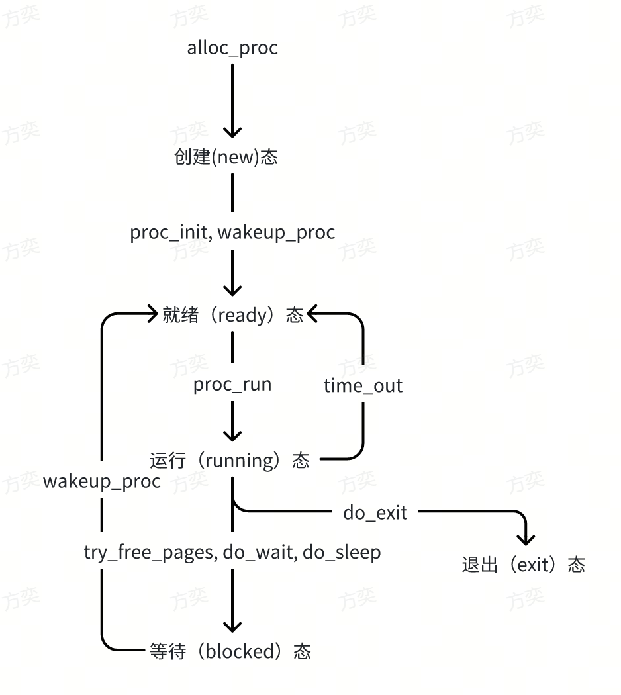

### **练习 1: 加载应用程序并执行（需要编码）**

**do_execv** 函数调用 load_icode（位于 kern/process/proc.c 中）来加载并解析一个处于内存中的 ELF 执行文件格式的应用程序。你需要补充 load_icode 的第 6 步，建立相应的用户内存空间来放置应用程序的代码段、数据段等，且要设置好 proc_struct 结构中的成员变量 trapframe 中的内容，确保在执行此进程后，能够从应用程序设定的起始执行地址开始执行。需设置正确trapframe 内容。 

请在实验报告中简要说明你的设计实现过程。 

• 请简要描述这个用户态进程被 ucore 选择占用 CPU 执行（RUNNING 态）到具体执行应用程序第一条指令的整个经过。

 

代码实现如下：

```c++
tf->gpr.sp = USTACKTOP;

tf->epc = elf->e_entry;

tf->status = (sstatus & ~SSTATUS_SPP) | SSTATUS_SPIE;
```

以下为代码解释：

`tf->gpr.sp = USTACKTOP;`: 将 trapframe 的通用寄存器（gpr）中的栈指针（sp）设置为用户栈的顶部（USTACKTOP）。这意味着当用户进程恢复执行时，它将使用指向用户栈顶的栈指针。

`tf->epc = elf->e_entry;`: 将 trapframe 的程序计数器（epc）设置为 ELF 文件的入口点（elf->e_entry）。这是用户程序的起始执行地址，表明用户程序从这个地址开始执行。

`tf->status = (sstatus & ~SSTATUS_SPP) | SSTATUS_SPIE;`: 设置 trapframe 的状态寄存器（status）。首先，通过 sstatus & ~SSTATUS_SPP 将状态寄存器中的 SPP位清零，确保用户模式（U-mode）。然后，通过 | SSTATUS_SPIE 将 SPIE位置为1，允许中断。

 

用户态进程被 ucore 选择占用后，首先会调用switch_to切换上下文，然后通过switch_to中的ret指令跳转到ra寄存器指向的地址，而在copy_thread函数中以将ra寄存器设置为forkret函数的地址，因此会执行forkret函数，转到执行forkrets(current->tf)，然后跳转到__trapret，执行sret指令回到用户态，跳转到epc指向的地址，即设置的elf文件的入口地址，进而在用户态执行应用程序。

### 练习 2: 父进程复制自己的内存空间给子进程（需要编码）

创建子进程的函数 do_fork 在执行中将拷贝当前进程（即父进程）的用户内存地址空间中的合法内容到新进程中（子进程），完成内存资源的复制。具体是通过 copy_range 函数（位于 kern/mm/pmm.c 中）实现的，请补充 copy_range 的实现，确保能够正确执行。 

请在实验报告中简要说明你的设计实现过程。 

• 如何设计实现 Copy on Write 机制？给出概要设计，鼓励给出详细设计。Copy-on-write（简称 COW）的基本概念是指如果有多个使用者对一个资源 A（比如内存块）进行读操作，则每个使用者只需获得一个指向同一个资源 A 的指针，就可以该资源了。若某使用者需要对这个资源 A 进行写操作，系统会对该资源进行拷贝操作，从而使得该“写操作”使用者获得一个该资源 A 的“私有”拷贝—资源 B，可对资源 B 进行写操作。该“写操作”使用者对资源 B的改变对于其他的使用者而言是不可见的，因为其他使用者看到的还是资源 A。 

 

代码实现如下：

```c++
  void * src_kvaddr = page2kva(page);

  void * dst_kvaddr = page2kva(npage);

  memcpy(dst_kvaddr, src_kvaddr, PGSIZE);

  ret = page_insert(to, npage, start, perm);
```

以下为代码解释：

`src_kvaddr`和`dst_kvaddr`分别为父进程和子进程页面的虚拟内存地址，使用`memcpy`函数将`src_kvaddr`中的内容赋值到`dst_kvaddr`中，然后使用线性地址`start`建立`npage`的物理地址映射。

 

实现 Copy on Write 机制，可以在复制父进程的用户内存地址空间中的合法内容到子进程中，只复制其页表项而不是整个内存页，然后将页表项设置为只读。这样多个使用者能够获取页表项并且能够读取内存页内容。而当多个使用者需要写入时，会触发缺页异常，这样我们可以在缺页异常处理函数中再复制整个内存页并设置可写，这样就能够时每个使用者都获取一个拷贝资源用于写入。

### 练习 3: 阅读分析源代码，理解进程执行 fork/exec/wait/exit 的实现，以及系统调用的实现（不需要编码）

请在实验报告中简要说明你对 fork/exec/wait/exit 函数的分析。并回答如下问题： 

• 请分析 fork/exec/wait/exit 的执行流程。重点关注哪些操作是在用户态完成，哪些是在内核态完成？内核态与用户态程序是如何交错执行的？内核态执行结果是如何返回给用户程序的？

• 请给出 ucore 中一个用户态进程的执行状态生命周期图（包执行状态，执行状态之间的变换关系，以及产生变换的事件或函数调用）。（字符方式画即可） 

 

`fork`：

用户态：父进程调用 fork 系统调用。在用户态，它会复制当前进程的地址空间、文件描述符等信息，并创建一个新的子进程。

内核态：当 fork 系统调用发生时，操作系统的内核被调用。在内核态，操作系统会为新的子进程分配资源，例如新的进程标识符、内存空间等。父子进程的执行流程是分离的，但它们共享相同的代码和数据。

 

`exec`：

用户态：进程调用 exec 系统调用来加载一个新的程序。在用户态，进程会准备好新程序的参数，并执行 exec 调用。

内核态：当 exec 系统调用发生时，操作系统内核被调用。在内核态，操作系统会加载新程序的代码和数据到进程的地址空间，替换原来的程序映像。

 

`wait`：

用户态：父进程调用 wait 系统调用等待其子进程的终止。在用户态，父进程被阻塞等待。

内核态：当子进程终止时，操作系统内核会将子进程的退出状态传递给父进程，并解除父进程的阻塞状态。这是一个典型的内核态到用户态的切换。

 

`exit`：

用户态：进程调用 exit 系统调用来终止自己的执行。在用户态，进程会清理资源并返回退出状态。

内核态：当 exit 系统调用发生时，操作系统内核被调用。在内核态，操作系统会回收进程占用的资源，并将退出状态传递给父进程（如果有的话）。

 

对于内核态执行结果是如何返回给用户程序的，有以下的传递方法：

寄存器传递：在RISC-V中，a0 寄存器通常用于存储函数的返回值。内核在执行系统调用结束后，将返回值放置在适当的寄存器中。

栈传递： 在一些情况下，返回值可能无法直接放在寄存器中。相反，内核可能会将返回值放置在用户程序的栈上。用户程序在执行系统调用之前会在栈上留出空间，用于存储返回值。

 

 ucore 中一个用户态进程的执行状态生命周期图：


